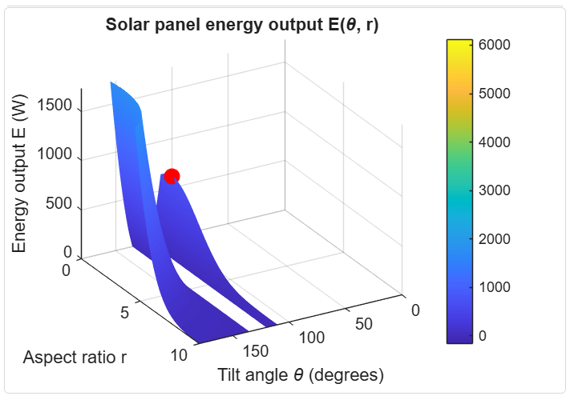

# Model 2: Scalable Constraints 
The purpose of this model is to find the maximum energy output when constraints can be varied. This allows for greater flexibility and practicality. 

## Instructions 
### Detailed Instructions on HOW TO CODE are in [Model-2 Report](SolarPanel3_Final_Model2.pdf)

#### Step 1: Implement the Optimization Problem w/ *Sliders*
By defining the optimization variables Tilt Angle (theta) and Aspect Ratio (r), the solver finds the highest energy output given the varying constraints of Tilt Angle and Aspect Ratio. 

In Model 2, the environmental **Constraints are Scalable**. This provides a more practical usage of how to optimize for Maximum Energy Output. 

Utilizing the [control panel](https://www.mathworks.com/help/matlab/matlab_prog/add-interactive-controls-to-a-live-script.html), sliders will be used to set the upper and lower bounds of each optimization variable. 

- Absolute Min & Max limit for Tilt Angle () using slider: 0° ≤ θ ≤ 180 ° (this can be changed by right clicking on the slider and pressing 'Configure Control')
- Absolute Min & Max limit of Aspect Ratio (r) using slider: 0 ≤ r ≤ 10  (can be changed the same way as above)

Where to find the Control Panel:

### Project Files
- [Model-2 Report](SolarPanel3_Final_Model2.pdf)
- [Model-2 MATLAB LiveScript](SolarPanel3_Final_Model2.mlx)

## Results

