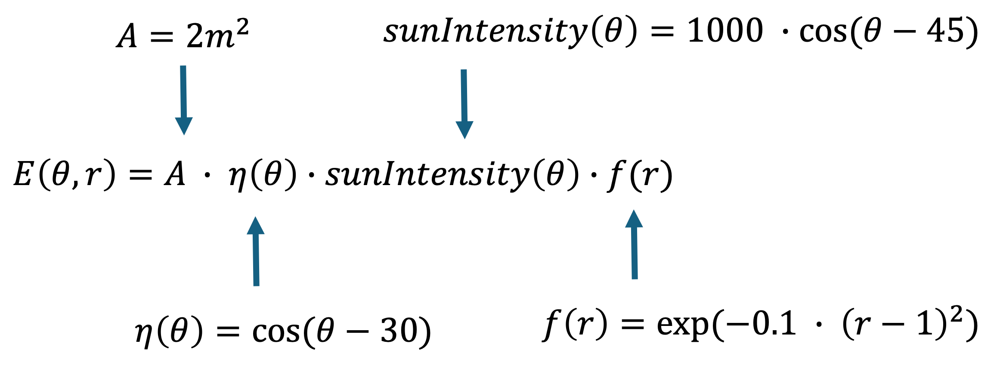

# Model 3: Time Optimization Variable
This project uses MATLAB to figure out the optimal tilt angle, aspect ratio, and time of day for a solar panel with a fixed area of 2 m², using a problem-based optimization workflow to maximize a simplified energy output model.
## Instructions
### THE CODE IS IN [Model-3 Report]()
#### Break Down the Problem:
Problem Statement:
Find the tilt angle θ, aspect ratio r, and time of day t that maximize the modeled energy output of a solar panel with a fixed area of 2 m².

- The panel tilt angle must satisfy: 0° ≤ θ ≤ 90°
- The aspect ratio must satisfy: 0.5 ≤ r ≤ 4
- The time of day must satisfy: 6 ≤ t ≤ 18
  
Where:
t = 6 is 6 AM 
t = 12 is 12 PM 
t = 18 is 6 PM 

The project needs to use MATLAB's problem-based optimization workflow, produce a 3D surface plot, and print out the optimal tilt angle, aspect ratio, time, and max energy output.
Proposed Solution

Start from the original energy model and extend it with a time-dependent sunlight factor. From there, set up bounded optimization variables, solve for the max of the energy function, and evaluate the model over a meshgrid so we can actually visualize it.
Roughly, the steps are: define the panel area and efficiency functions, define the sunlight intensity function, add the time factor, combine everything into one energy model, set up the optimization problem and variables, solve for the optimal θ, r, and t, plot the energy surface at the optimized time, then print and interpret the results.
Challenges

Getting the degree-based trig functions to behave was one issue, since MATLAB's optimization variables don't play nice with cosd/sind the way regular numeric arrays do, so those had to be rewritten with cos/sin and a manual degrees-to-radians conversion. Keeping the plotting version of the equations consistent with the optimization version was another thing we had to double check, along with making sure everything used element-wise operations once we started working with grids of values.
Adding a third variable (time) without blowing up the structure of the original two-variable model was also tricky. A normal 3D surface plot can only really show two variables at once, so time gets fixed at its optimal value whenever we're plotting tilt angle against aspect ratio.

#### Step 1: Define the Objective Function
The objective function calculates the modeled energy output based on panel area, tilt angle, sunlight intensity, aspect ratio, and time of day. Basically E(θ,r) from the original model became E(θ,r,t).

Note: The function "cosd" calculates values in degrees instead of radians, multiply by pi/180 inside the function converts the value into radians

