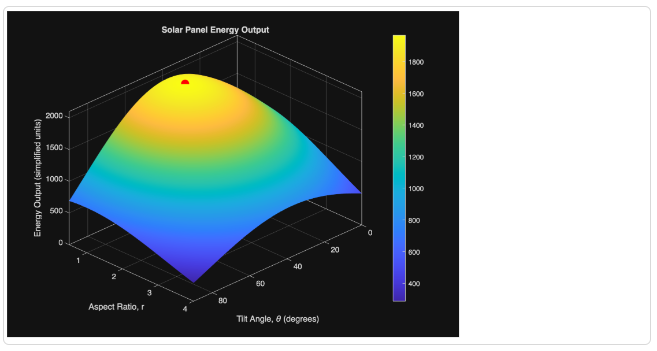
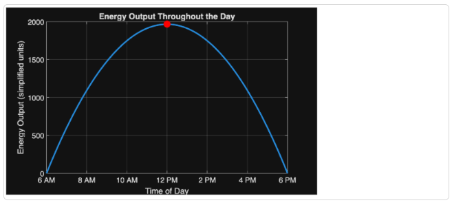
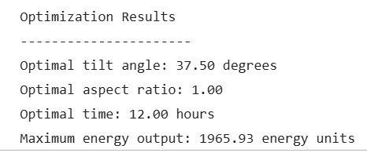

# Model 3: Time Optimization Variable
This project uses MATLAB to figure out the optimal tilt angle, aspect ratio, and time of day for a solar panel with a fixed area of 2 m², using a problem-based optimization workflow to maximize a simplified energy output model.
## Instructions
### THE CODE IS IN [Model-3 Report]()
#### Break Down the Problem:
Problem Statement:
Find the tilt angle θ, aspect ratio r, and time of day t that maximize the modeled energy output of a solar panel with a fixed area of 2 m².

- The panel tilt angle must satisfy: 0° ≤ θ ≤ 90°
- The aspect ratio must satisfy: 0.5 ≤ r ≤ 4
- The time of day must satisfy: 6 ≤ t ≤ 18
  
Where:
t = 6 is 6 AM 
t = 12 is 12 PM 
t = 18 is 6 PM 

The project needs to use MATLAB's problem-based optimization workflow, produce a 3D surface plot, and print out the optimal tilt angle, aspect ratio, time, and max energy output.
Proposed Solution

Start from the original energy model and extend it with a time-dependent sunlight factor. From there, set up bounded optimization variables, solve for the max of the energy function, and evaluate the model over a meshgrid so we can actually visualize it.
Roughly, the steps are: define the panel area and efficiency functions, define the sunlight intensity function, add the time factor, combine everything into one energy model, set up the optimization problem and variables, solve for the optimal θ, r, and t, plot the energy surface at the optimized time, then print and interpret the results.
Challenges

Getting the degree-based trig functions to behave was one issue, since MATLAB's optimization variables don't play nice with cosd/sind the way regular numeric arrays do, so those had to be rewritten with cos/sin and a manual degrees-to-radians conversion. Keeping the plotting version of the equations consistent with the optimization version was another thing we had to double check, along with making sure everything used element-wise operations once we started working with grids of values.
Adding a third variable (time) without blowing up the structure of the original two-variable model was also tricky. A normal 3D surface plot can only really show two variables at once, so time gets fixed at its optimal value whenever we're plotting tilt angle against aspect ratio.

#### Step 1: Define the Objective Function
The objective function calculates the modeled energy output based on panel area, tilt angle, sunlight intensity, aspect ratio, and time of day. Basically E(θ,r) from the original model became E(θ,r,t).

Note: The function "cosd" calculates values in degrees instead of radians, multiply by pi/180 inside the function converts the value into radians

#### Step 2: Implement Optimization Function 
The [optimization problem](https://www.mathworks.com/help/releases/R2026a/optim/ug/problem-based-workflow.html?searchPort=57359) solves for the **Maximum Energy** Output. 

This sets up the optimization problem to search for the θ, r, and t that maximize energy output, within the bounds given above.

By defining the optimization variables Tilt Angle (theta), Aspect Ratio (r) & time of day (t) the solver finds the highest energy output given the fixed constraints.

In Model 3, the time of day variable (t), is added to the constraints. 
- Constraint for Tilt Angle: 0° ≤ θ ≤ 90°
- Constraint for Aspect Ratio: 0.5 ≤ r ≤ 4
- Constraint for Time of Day: 6 ≤ t ≤ 18

#### Step 3: Output the Results 
**Plot E(θ, r, t)** to visualize the energy as a surface plot using *meshgrid* and [surf](https://www.mathworks.com/help/matlab/ref/surf.html). Plot the optimal tilt angle, aspect ratio & time of day corresponding to the maximum energy output onto the grid; the absolute maximum of the surface plot should align with the optimal point. Finally, print the optimal tilt angle, aspect ratio & time of day and the Maximum energy output.

The surface plot shows energy output as a function of tilt angle and aspect ratio, with time held at its optimized value.
Checklist: 
- Create Grid Values for Tilt Angle and Aspect Ratio using meshgrid
- Generate energy grid values that are dependent on θ, r & t.
- Create the Surface Plot using the surf function
- Add shading that illustrate the gradual change in energy output using shading and colorbar functions
- Set Axis limits for the plot (they can be equal to or greater then constraints)
- Label the plots
- Plot the optimal point on the surface plot

#### Step 4: Plot Energy Output Over Time
Shows how energy changes across the day once tilt angle and aspect ratio are locked at their optimal values.
Checklist: 
- Plot grid values using Time of day (t) and Energy Output values
- Plot the optimal point on the surface plot
- Set Axis limits for the plot (they can be equal to or greater then constraints)
- Label the plots

#### Step 5: Print the Results

### Project Files:

## Results
#### Summary
The optimizer lands on a tilt angle of about 37.5°, an aspect ratio right around 1, and a time of 12 PM.
The tilt angle ends up between 30° and 45° because two different angle-dependent terms are pulling in slightly different directions panel efficiency peaks near 30°, but sunlight intensity peaks near 45°. The solver settles somewhere in between since that's where the product of the two is largest.
Aspect ratio comes out to basically 1, which makes sense given the shape efficiency function is built to peak exactly at r = 1.
Noon being optimal isn't surprising either the time factor is just a parabola centered on t = 12, so it's maxed out there by construction.
#### Limitations
This model is pretty simplified and skips a lot of what actually affects real solar panels — weather, cloud cover, seasonal changes, geographic location, temperature, shading from nearby trees or buildings, and solar azimuth are all left out. The time factor is also just a rough parabola rather than anything based on real irradiance data. On top of that, treating time as something we're "optimizing" is a little odd conceptually, since it's really an environmental condition and not a design choice for the panel itself.
#### Next Steps
Swapping the simplified time function for real solar irradiance data would be the most useful next step. Beyond that, the model could be extended to account for shading, seasonal sun angles, geographic location, or panel azimuth. It'd also be worth optimizing for total energy produced over a full day rather than just the single moment when instantaneous output is highest.
