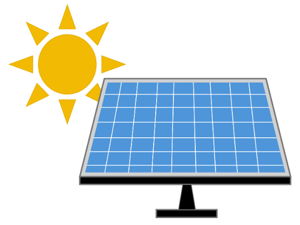
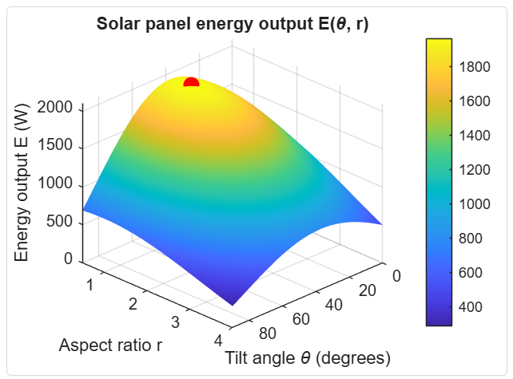

<table>

<td></td>

<td>
<h1> 
   SOLUTION - Maximizing Solar Panel Output for a Fixed Area 
   </h1>

   
<h2>     
   Solar Panel Team #3         
   </h2>

</table>

## MathWorks Workplace Challenge - Maximizing Solar Panel Output for a Fixed Area
Hello, and welcome! This repo will carry out the joint project between Hector Valenzuela, Leo Kuraoka, and Ty Schoevers. Our motivation for this project stemmed from our team's collective desire in developing modern energy grid systems and a interest in creating tools for scalability of renewable energy technology. 

### Table of Contents: 
- [Project Description](README.md)
- [Model 1: Fixed Constraints](Model-1/Model-1.md)
- [Model 2: Scalable Constraints](Model-2/Model-2.md)
- [Model 3: Time Optimization Variable](Model-3/Model-3.md)
- [Google Drive Folder](https://drive.google.com/drive/folders/1tbksG6ZGN-f3NW-npphn4tbyp6_-fJ5V?usp=sharing)

# Project Description 
In this project, we're using MATLAB to identify the best tilt angle and shape for a solar panel with a fixed area of 2 square meters. The aim is to maximize energy output of the solar panel given a variety of constraints. This project applies MATLAB's [optimization workflow](https://www.mathworks.com/help/releases/R2026a/optim/ug/problem-based-workflow.html?searchPort=57359) to a real-world engineering problem, then visualizes the results with a 3D surface plot.

### Team/Roles
- Ty Schoevers - Project Manager
- Hector Valenzuela - MATLAB Modeling Lead
- Leo Kuraoka - Analysis & Visualization Lead

[Team Agreement](reports/MathWorks_SolarPanel3_TeamAgreement.pdf)

## Project Steps: 
For this project, the Solar Irradiance/Energy Production formula has been given below:

To approach this problem recognize that the Solar Energy formula is dependent on:
- Tilt Angle (θ) with respect to the sun
- Shape/Aspect Ratio (r) of the panel
- The available Area (A) for installation

As the functions η(θ), sunIntensity(θ), & f(r) act non-linearly; finding the Maximum Energy Output under any constraints would be numerically intensive and non-intuitive. Through MATLAB's
[problem-based optimization workflow](https://www.mathworks.com/help/releases/R2026a/optim/ug/problem-based-workflow.html?searchPort=57359) the process of finding the optimal Tilt Angle (θ) and Aspect Ratio (r) to deliver **Maximum Energy Output** can be simplified. 

Constructing a 3D [surf](https://www.mathworks.com/help/matlab/ref/surf.html) plot of the Energy formula E(θ,r) can act as a form of verifying results. As the Maximum point should align with the highest point of the surface plot. 

In this project, you will see the many ways our team have developed the optimization problem and improved on it. 

#### Disclaimer: 
For this project MATLAB R2026a was used to run the live script. To run the code the **Optimization Toolbox™** is needed. 

## Models: 
- Model 1: [Fixed Constraints](Model-1/Model-1.md)
- Model 2: [Scalable Constraints](Model-2/Model-2.md)
- Model 3: [Time Optimization Variable](Model-3/Model-3.md)
## References
- [MathWorks GitHub Classroom Challenge Projects](https://github.com/mathworks/MATLAB-Simulink-Challenge-Project-Hub/tree/main/Classroom%20Challenge%20Projects/Projects/Maximizing%20Solar%20Panel%20Output%20for%20a%20Fixed%20Area)
- [GitHub Repository Template](https://github.com/kathyz95/Classroom-Projects-Solution-Template/)
- [Student Project Template](reports/SolarPanel_StudentProjectTemplate_Preview.pdf)
- [MATLAB Onramp](https://matlabacademy.mathworks.com/details/matlab-onramp/gettingstarted)
- [Optimization Onramp](https://matlabacademy.mathworks.com/details/optimization-onramp/optim)
- [problem-based optimization workflow](https://www.mathworks.com/help/releases/R2026a/optim/ug/problem-based-workflow.html?searchPort=57359)
- [Surface Plot](https://www.mathworks.com/help/matlab/ref/surf.html)
- [Control Panel](https://www.mathworks.com/help/matlab/matlab_prog/add-interactive-controls-to-a-live-script.html)
  
# Contact 
Ty Schoevers: 
- Email: ty.schoevers@gmail.com 
- [LinkedIn](https://www.linkedin.com/in/ty-schoevers/)

Hector Valenzuela: 
- Email: Hlvnates75@gmail.com
- [LinkedIn](https://www.linkedin.com/in/hector-luis-valenzuela/)

Leo Kuraoka:
- Email: leokuraoka2@gmail.com
- [LinkedIn](https://www.linkedin.com/in/leo-kuraoka-5ab2171b3/)
